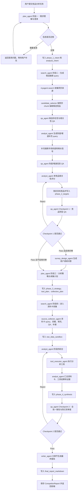
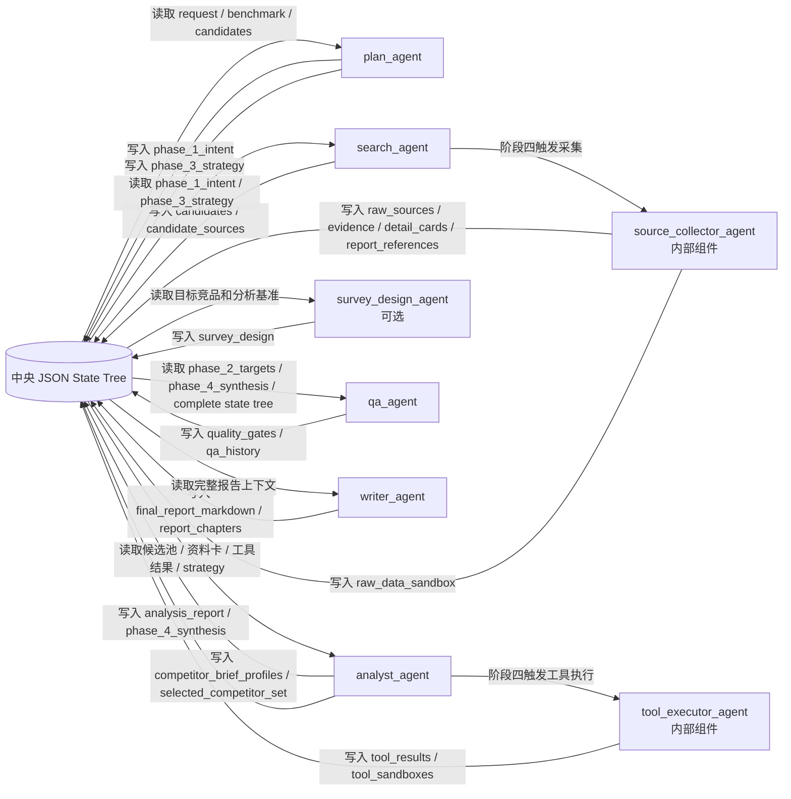
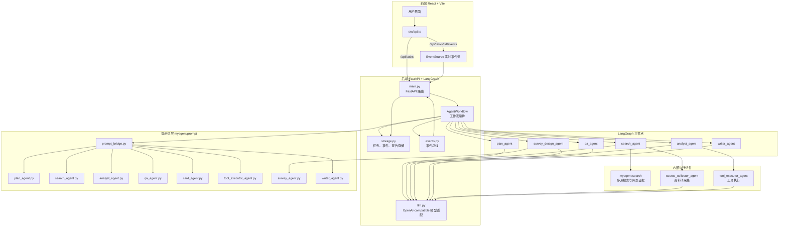
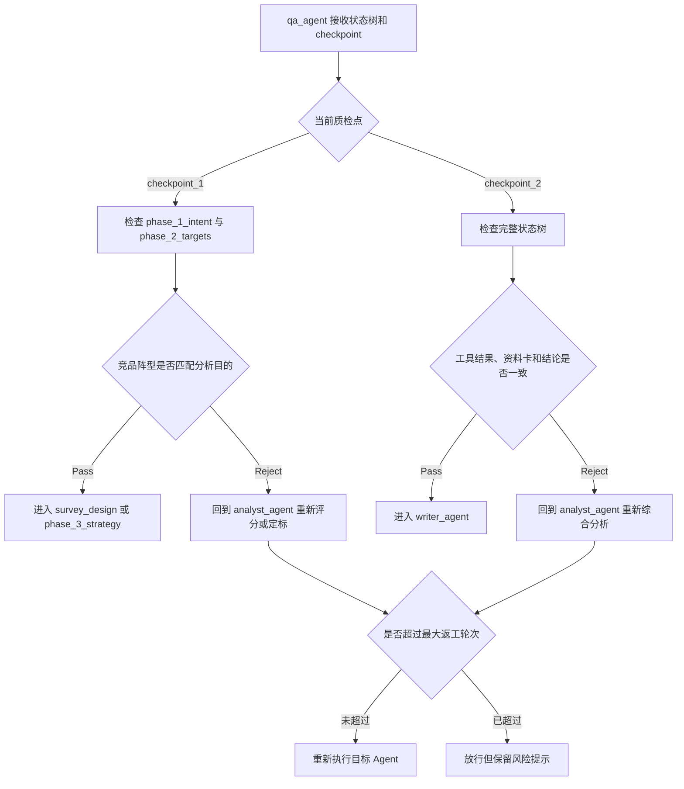
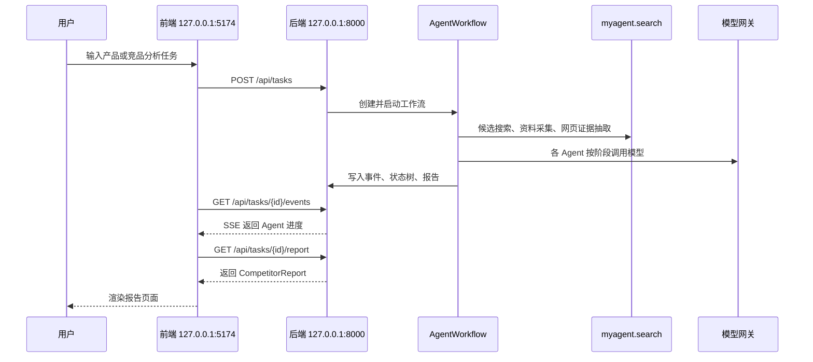

# 多智能体执行流程与框架图

本文档描述当前 `myagent` 后端实际运行的 Multi-Agent 工作流、状态树写入关系、前后端架构以及关键文件位置。当前代码入口为 `myagent/backend/app/agents/workflow.py`。

## 一、核心设计

当前后端以 `AgentWorkflow` 为主入口，主图中注册 6 个可路由节点：

- `plan_agent`：规划 Agent，负责阶段一需求理解、阶段三分析策略和采集策略规划。
- `search_agent`：搜索 Agent，负责阶段二候选竞品发现，以及阶段四触发资料卡采集。
- `analyst_agent`：分析 Agent，负责阶段二候选补充检索、热度/增速 QA、竞品评分、目标锁定，以及阶段四工具执行后的综合分析。
- `survey_design_agent`：问卷设计 Agent，可选节点，用于根据已锁定竞品生成用户调研问卷。
- `qa_agent`：质量检查 Agent，负责竞品阵型 QA 和最终状态树 QA。
- `writer_agent`：报告撰写 Agent，负责分章节生成最终 Markdown 报告。

还有两个重要的内部执行组件，不是 LangGraph 主图节点，但会在对应阶段被调用：

- `source_collector_agent`：由 `search_agent` 在 `workflow_phase == "phase_4_collect"` 时调用，负责资料卡 query、网页采集、chunk 填充、资料卡 QA 和缺口补搜。
- `tool_executor_agent`：由 `analyst_agent` 在 `workflow_phase == "phase_4_synthesis"` 时调用，负责执行已选分析工具并产出结构化 claims。

已移除：

- `structurer_agent` 已不再注册为主流程节点，`myagent/prompt/structurer_agent.py` 已删除。

中央状态树由 `create_initial_state_tree(request)` 初始化，核心节点包括：

- `phase_1_intent`：用户意图、生命周期、分析目的、目标产品、目标市场等。
- `phase_2_targets`：最终锁定的竞品集合、选择逻辑和候选评分结果。
- `phase_3_strategy`：分析框架、分析工具、采集维度和采集计划。
- `raw_data_sandbox`：阶段四采集得到的原始资料和证据摘要。
- `phase_4_synthesis`：综合分析结果、工具分析摘要和行动建议。
- `quality_gates`：checkpoint 1 和 checkpoint 2 的 QA 结果。
- `final_report_markdown`：最终 Markdown 报告正文。

## 二、当前执行流程图

## 三、Agent 与状态树读写关系

## 四、后端工作流框架图

## 五、QA 回路机制

## 六、端口与调用关系

默认开发配置：

- 前端 Vite 端口：`5174`
- 后端 FastAPI 端口：`8000`
- 前端 `/api` 和 `/health` 请求由 Vite 代理到 `http://127.0.0.1:8000`
- 后端 CORS 建议包含 `http://localhost:5174` 和 `http://127.0.0.1:5174`

## 七、关键文件

- `myagent/backend/app/agents/workflow.py`：工作流编排入口。
- `myagent/backend/app/agents/state_tree.py`：状态树初始化、合并和转换工具。
- `myagent/backend/app/agents/prompt_bridge.py`：后端到 prompt 文件的统一桥接层。
- `myagent/backend/app/agents/search_runner_adapter.py`：后端对 `myagent.search` 的适配层。
- `myagent/backend/app/agents/candidate_selector.py`：候选竞品 chunk 抽取、合并和筛选。
- `myagent/backend/app/agents/card_collector.py`：资料卡 query、采集、填充、QA 和补搜。
- `myagent/backend/app/agents/tool_executor.py`：分析工具执行。
- `myagent/backend/app/agents/survey.py`：问卷设计和问卷结果分析。
- `myagent/search/`：多源搜索、网页正文、截图、OCR、LLM 抽取和证据定位工具。
- `myagent/prompt/plan_agent.py`：规划 Agent prompt。
- `myagent/prompt/search_agent.py`：搜索 Agent prompt。
- `myagent/prompt/analyst_agent.py`：分析 Agent prompt。
- `myagent/prompt/qa_agent.py`：QA Agent prompt。
- `myagent/prompt/card_agent.py`：资料卡采集 prompt。
- `myagent/prompt/tool_executor_agent.py`：工具执行 prompt。
- `myagent/prompt/survey_agent.py`：问卷设计和问卷分析 prompt。
- `myagent/prompt/writer_agent.py`：报告撰写 prompt。
- `myagent/backend/app/main.py`：FastAPI 接口入口。
- `myagent/frontend/src/api.ts`：前端请求封装。
- `myagent/frontend/vite.config.ts`：前端端口和代理配置。

## 八、当前注意点

- `structurer_agent` 已删除，不应再出现在主流程图中。
- `source_collector_agent` 和 `tool_executor_agent` 是内部执行组件，不是当前 LangGraph 主图路由节点。
- `survey_design_agent` 是可选主图节点，仅在 `enable_survey_design_agent` 且尚未生成问卷时进入。
- `myagent.search` 已移动到 `myagent/search`，旧的根目录 `search/` 不再存在。
